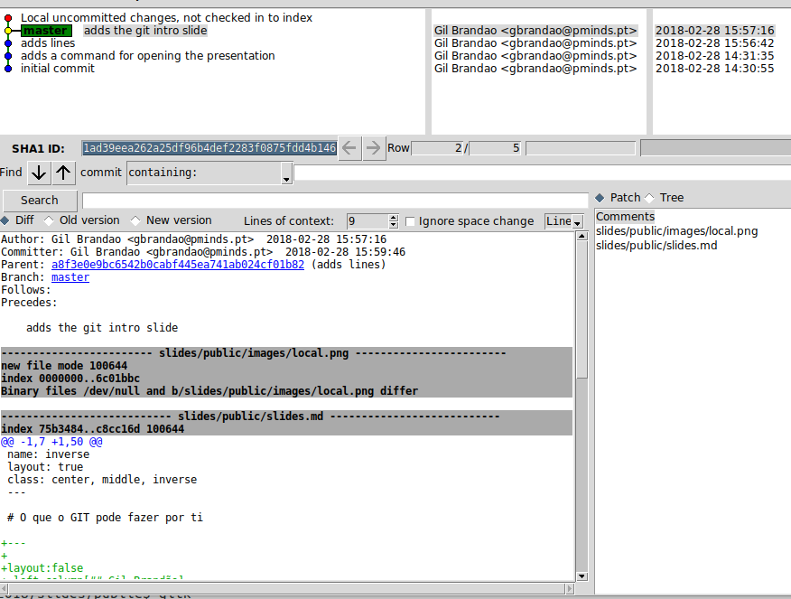

name: inverse
layout: true
class: center, middle, inverse
---

# O que o GIT pode fazer por ti

---

layout:false
.left-column[## Gil Brandão]
.right-column[

- Developer @ Premium Minds (since 2011)

- Linux zealot

- Ferramentas pequenas, simples(??) e especializadas

]

---
template: inverse
## O GIT é...
---

layout: false
.left-column[
  ## O que é
  ]

.right-column[

**_Distributed_** **Version Control** System

- Distribuido: o GIT opera **localmente** (quase exclusivamente)


- Controlo de versões: registo manual das sucessivas versões do conteúdo a
  versionar

- Não é uma ferramenta exclusiva para código fonte. Funciona bem em
  geral também é usável com binários como imagens (mas não é tão útil)


]


---

.left-column[
  ## O que é
  ## Para que serve
  ]

.right-column[

O GIT serve essencialmente como máquina do tempo


-  Quando alguma coisa deixa de funcionar...

  - podemos voltar atrás e verificar que funcionava

  - podemos ver diferenças para averiguar o que pode ter causado o problema

- Quando não se percebe o porquê daquela linha de código...

  - Olhar para o "_histórico da linha_" pode ajudar a dar contexto

- Colaboração na criação do conteúdo

- Garantir  a integridade do código: é impossível alterar histórico sem que
  outros intervinientes percebam que houve alterações do histórico


]


---
template: inverse

## Quando trabalho sózinho...

---

## Quando trabalho sózinho, o GIT:
.right-column[

- ajuda-me a voltar para trás no tempo (uuups, &#x1F4A9;)

- deixar notas especificas sobre alterações específicas (pseudo documentação)

- noção do tempo que gastei (quando e como)

- experimentar

- replicar o conteúdo em múltiplas localizações (backup _ad-hoc_)


]


---
template: inverse

## Mãos à obra...

---


.left-column[
  ## Tools
]
.right-column[

1. git

1. helpers:

  1. diff tool: kdiff, meld, kdiff3

  1. commit tool: git-gui, gitg, GitKraken, Tower, SourceTree, ...

  1. repo browser: gitk, gitg, GitKraken, Tower, SourceTree, ...


(install time)


]
---

.left-column[
### E tudo começa com...
]

.right-column[


- _And there was the Big Bang_


```bash
$ git init <$directoria> # novo repositorio
```

- Em alternativa caso há exista um ponto de partida

```bash
$ git clone <$url_do_repositorio> # clona repositorio existente
```
]


---


.left-column[
### E tudo começa com...
### &#x1F913;
]

.right-column[

Clonar o repositório deste workshop:

```bash
$ git clone "https://github.com/madskaddie/git-sinfo2018.git"
```


O histórico pode ser consultado:


```bash
$ git log -n3 #por causa do slide só mostro os últimos 3
commit 1ad39eea262a25df96b4def2283f0875fdd4b146
Author: Gil Brandao <gbrandao@pminds.pt>
Date:   Wed Feb 28 15:57:16 2018 +0000

    adds the git intro slide

commit a8f3e0e9bc6542b0cabf445ea741ab024cf01b82
Author: Gil Brandao <gbrandao@pminds.pt>
Date:   Wed Feb 28 15:56:42 2018 +0000

    adds lines

commit b1c1ec342b982ecf79cb8f3f3f4c79981256d320
Author: Gil Brandao <gbrandao@pminds.pt>
Date:   Wed Feb 28 14:31:35 2018 +0000

    adds a command for opening the presentation
```


]

---

.left-column[
### E tudo começa com...
### &#x1F913;
### um pouco mais visual
]

.right-column[

```bash
$ gitk
```




]

---

.left-column[
### Commit
]

.right-column[

```bash
$ git add "$filename" # git add???
$ git commit -m "some message"
```

]

---

.left-column[
### Commit
### Status
]

.right-column[

```bash
$ git add "$filename" # git add???
$ git commit -m "some message"
```


```bash
$ git status
On branch master
Your branch is up-to-date with 'origin/master'.
Changes to be committed:
  (use "git reset HEAD <file>..." to unstage)

    modified:   slides/public/slides.md

Changes not staged for commit:
  (use "git add <file>..." to update what will be committed)
  (use "git checkout -- <file>..." to discard changes in working directory)

    modified:   slides/public/slides.md

Untracked files:
  (use "git add <file>..." to include in what will be committed)

    app/

```

]


---

.left-column[
### Commit
### Status
### Staging area
]

.right-column[

]


---

.left-column[
### Commit
### Status
### Staging area
### Working Directory
]

.right-column[

- Working directory

```bash
$ ls .
app  bin  conf  slides
```

- Repositorio

```bash
$  ls -A
app
bin
conf
.git # <- onde tudo vive
.gitignore
slides
```

]


---

.left-column[
### Branching
]

.right-column[

Os _branches_ permitem ter várias linhas de desenvolvimento independentes
(vários histórios) com o objectivo de os juntar num futuro

Experimentar uma coisa, sem o risco de estragar nada, faz-se através da
utilização de um branch distinto

Juntar os 2 históricos independentes faz-se através de uma operação chamada
_merge_

```bash
$ git branch -a
* master
  remotes/origin/master

$ git checkout -b novo_branch #cria um branch novo e muda a working directory
M   slides/public/slides.md
Switched to a new branch 'novo_branch'

$ git branch -a
  master
* novo_branch
  remotes/origin/master

```

]


---

.left-column[
### Remote
]

.right-column[

```bash
$ git remote -v
origin  git@github.com:madskaddie/git-sinfo2018.git (fetch)
origin  git@github.com:madskaddie/git-sinfo2018.git (push)

```

Duas operações grandes remotas apenas:

- leitura, _fetch_ (_remote update_, _pull_\*): importa o repositório (total ou parcialmente) e
  actualiza localmente todas as referências remotas

```bash
$ git remote update
Fetching origin
```

- escrita: _push_ exporta conteudo e actualiza as referências remotas

```bash
$ git push origin master:master
objects: 24, done.
Delta compression using up to 4 threads.
Compressing objects: 100% (17/17), done.
Writing objects: 100% (24/24), 37.24 KiB | 0 bytes/s, done.
Total 24 (delta 5), reused 0 (delta 0)
remote: Resolving deltas: 100% (5/5), done.
To github.com:madskaddie/git-sinfo2018.git
 * [new branch]      master -> master
```
]


